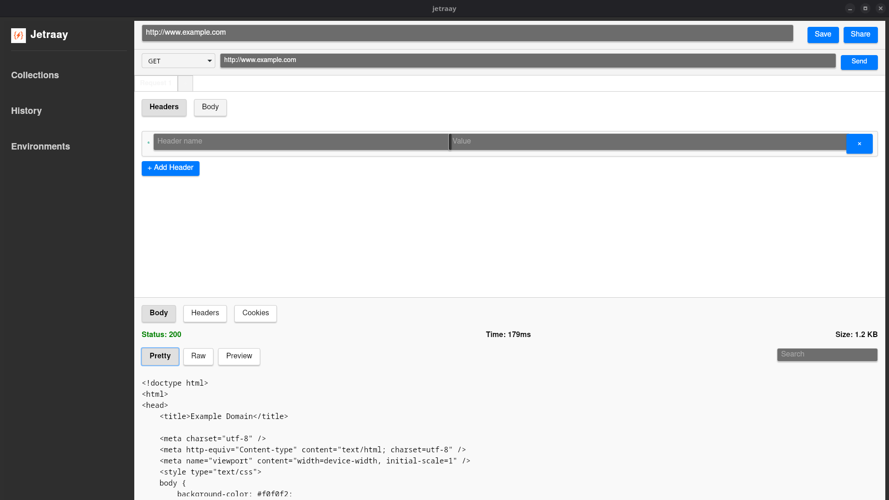

# Jetraay


Jetraay is an API development tool built using modern web technologies. It provides a user-friendly interface for testing and debugging APIs.

## Technologies Used

- **Frontend**: React, TypeScript, Vite
- **Backend**: Rust (via Tauri)
- **UI Styling**: CSS
- **Build Tool**: Vite
- **Tauri Plugins**: 
  - `@tauri-apps/api`
  - `@tauri-apps/plugin-opener`

## Features

- Send HTTP requests with various methods (GET, POST, PUT, DELETE, etc.).
- Add custom headers, body, and query parameters.
- Support for raw, form-data, GraphQL, and binary body types.
- View response body, headers, and cookies.
- Save and share API requests.

## How to Build and Run

### Prerequisites

1. Install [Node.js](https://nodejs.org/) (v16 or later).
2. Install [Rust](https://www.rust-lang.org/tools/install) and [Cargo](https://doc.rust-lang.org/cargo/).
3. Install the Tauri CLI:
   ```sh
   cargo install tauri-cli
   ```

### Development

To start the development server:

```sh
npm install
npm run dev
```

This will start the Vite development server and the Tauri application.

### Build

To build the application for production:

```sh
npm run build
```

This will generate the frontend assets and package the Tauri application.

### Preview

To preview the production build:

```sh
npm run preview
```

### Running the Tauri Application

To run the Tauri application in development mode:

```sh
npm run tauri dev
```

To build the Tauri application for production:

```sh
npm run tauri build
```

## Recommended IDE Setup

- [VS Code](https://code.visualstudio.com/)
  - Extensions:
    - [Tauri](https://marketplace.visualstudio.com/items?itemName=tauri-apps.tauri-vscode)
    - [rust-analyzer](https://marketplace.visualstudio.com/items?itemName=rust-lang.rust-analyzer)

## Screenshots



