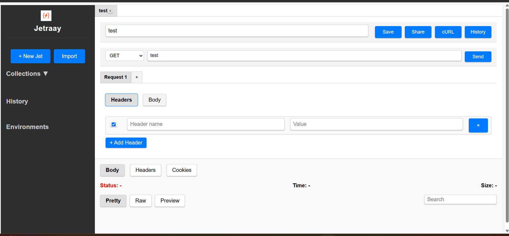

# Jetraay


Jetraay is an API development tool built using modern web technologies. It provides a user-friendly interface for testing and debugging APIs.

**Description**: Jetraay is a pick-and-replace open-source alternative to Postman. It is a lightweight application with super-speed processing, making it suitable for devices with limited memory.

## Technologies Used

- **Frontend**: React, TypeScript, Vite
- **Backend**: Rust (via Tauri)
- **UI Styling**: CSS
- **Build Tool**: Vite
- **Tauri Plugins**: 
  - `@tauri-apps/api`
  - `@tauri-apps/plugin-opener`

## Features

### Core Functionality
- **HTTP Request Methods**: Support for all standard HTTP methods (GET, POST, PUT, DELETE, PATCH, HEAD, OPTIONS).
- **Request Collections**: Save, organize, and reuse API requests for improved workflow.
- **URL Management**: Enter and manage request URLs with ease.
- **Response Visualization**: Clean, organized display of API responses.

### Request Configuration
- **Header Management**: 
  - Add, edit, enable/disable, and remove custom HTTP headers.
  - Automatic Content-Type header addition based on body type.
- **Body Types**:
  - **None**: For requests without a body.
  - **Raw**: Support for various content types (JSON, XML, HTML, Text, JavaScript).
  - **Form-data**: Send multipart/form-data for file uploads and form submissions.
  - **URL-encoded**: Send data in application/x-www-form-urlencoded format.
  - **Binary**: Support for sending binary file data.
  - **GraphQL**: Specialized support for GraphQL queries with separate fields for query and variables.

### Response Handling
- **Multiple Response Views**:
  - **Pretty**: Formatted view with syntax highlighting for JSON.
  - **Raw**: Unformatted raw response content.
  - **Preview**: HTML preview for web responses.
- **Response Details**:
  - Status code with visual indicators.
  - Response time in milliseconds.
  - Response size measurement.
- **Response Tabs**:
  - **Body**: View response body content.
  - **Headers**: View response headers in a structured table.
  - **Cookies**: View response cookies in a structured table.
- **Response Search**: Search within response content.

### History & Version Control
- **Request History**: Track and view all previous versions of requests.
- **Request Versioning**: Revert to previous versions of saved requests.
- **Automatic History Saving**: Every request is automatically saved to history.

### Collaboration & Export
- **cURL Command Generation**: Export any request as a cURL command.
- **Request Sharing**: Share requests with team members.
- **Collection Management**: 
  - Clone, rename, and delete saved requests.
  - Import and export collections.

### User Interface
- **Tab System**: Work with multiple requests simultaneously in tabs.
- **Sidebar Navigation**: Easy access to collections and history.
- **Responsive Design**: Works well on various screen sizes.

## How to Build and Run

### Prerequisites

1. Install [Node.js](https://nodejs.org/) (v16 or later).
2. Install [Rust](https://www.rust-lang.org/tools/install) and [Cargo](https://doc.rust-lang.org/cargo/).
3. Install the Tauri CLI:
   ```sh
   cargo install tauri-cli
   ```

### Development

To start the development server:

```sh
npm install
npm run dev
```

This will start the Vite development server and the Tauri application.

### Build

To build the application for production:

```sh
npm run build
```

This will generate the frontend assets and package the Tauri application.

### Preview

To preview the production build:

```sh
npm run preview
```

### Running the Tauri Application

To run the Tauri application in development mode:

```sh
npm run tauri dev
```

To build the Tauri application for production:

```sh
npm run tauri build
```

## Recommended IDE Setup

- [VS Code](https://code.visualstudio.com/)
  - Extensions:
    - [Tauri](https://marketplace.visualstudio.com/items?itemName=tauri-apps.tauri-vscode)
    - [rust-analyzer](https://marketplace.visualstudio.com/items?itemName=rust-lang.rust-analyzer)

## Screenshots


### Latest UI



## Progress

For detailed progress updates, check the [Progress Document](progress.md).


